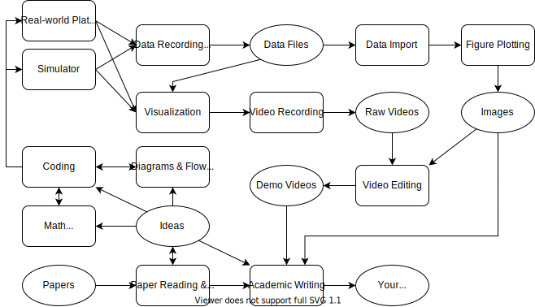
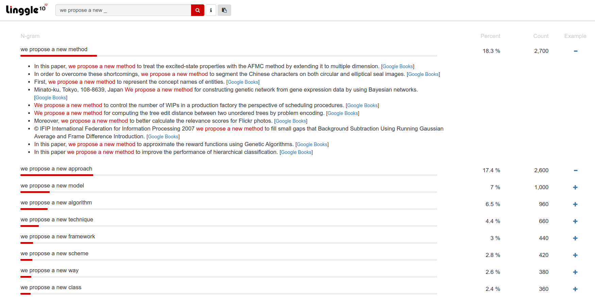
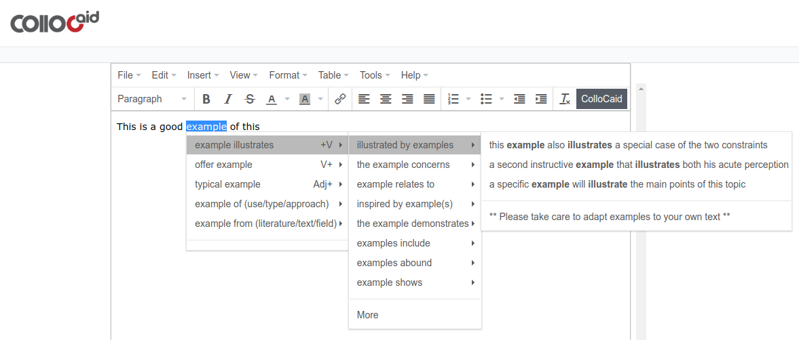
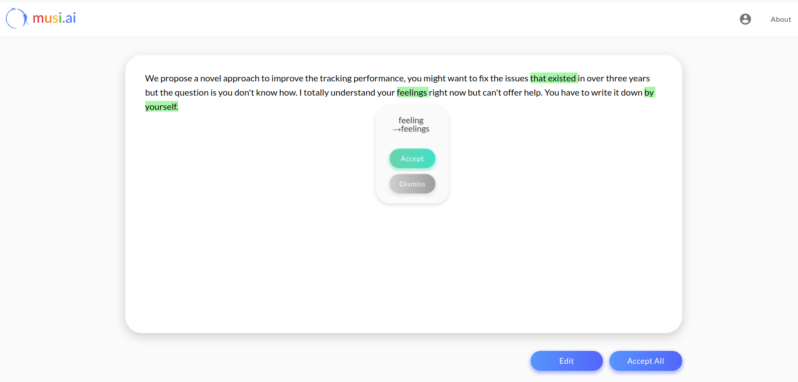

# make_work_easier
This is a repo that investigates or develops tools to make work easier and enjoyable, especially for research stuffs in the following workflow when we're working on robotics research projects. :point_right: [Quick Start](#quick-start)

* If you are interested in more useful software tools, see [this longer list](./software_list.md). 
* If you want some useful scripts in Ubuntu, see another repo [useful_scripts](https://github.com/Magic-wei/useful_scripts).
* **The remainder of this README is all about the research workflow.**

For each topic shown as rectangle in the workflow, you can find some useful tools that I've investigated, and most of them are still under use in my daily work. You can also find the `Code Snippets` folder in this repo which is a gallery for useful functions in Python, Matlab, C++ etc. If you have no idea about one of these specific topics, hope this repo could be the first place you should take a look at.

## Quick Start

  <b>--- Topic navigation ---</b> 
  <a href="#coding--documentation">Coding & Documentation</a> |
  <a href="#diagrams--flowcharts">Diagrams & Flowcharts</a> |
  <a href="#tables">Tables</a> |
  <a href="#math-tools">Math Tools</a> |
  <a href="#data-import--export">Data Import &amp; Export</a> |
  <a href="#figure-plotting">Figure Plotting</a> |
  <a href="#visualization">Visualization</a> |
  <a href="#screenshot--video-recording">Screenshot & Video Recording</a> |
  <a href="#video-editing">Video Editing</a> |
  <a href="#academic-writing">Academic Writing</a>

  <b>--- For more information ---</b> 
  <a href="./software_list.md">Longer Software  List</a> •
  <a href="https://github.com/Magic-wei/useful_scripts">Useful Scripts</a> •
  <a href="#todo">TODO</a> •
  <a href="#license">License</a>

## Coding & Documentation

### Markdown

Markdown is one of the most popular markup language which is designed to be a simple, lightweight way to add formatting without prior HTML experience. Github itself use Markdown to format its readme files. You can also use Markdown to format your own wiki files. And it supports HTML syntax too.

- [**Typora**](https://typora.io/#): There are many Markdown editors you can find online, among them, Typora could be a special one. Typora will give you a seamless experience as both a reader and a writer. It removes the preview window, mode switcher, syntax symbols of markdown source code, and all other unnecessary distractions. Replace them with a real live preview feature to help you concentrate on the content itself.
- [**StackEdit**](https://stackedit.io/): StackEdit is an in-browser markdown editor which supports different Markdown flavors such as Markdown Extra, GFM and CommonMark. It also supports LaTeX mathematical expressions, UML diagrams, emojis and even musical scores.
- [**Marp**](https://yhatt.github.io/marp/): Marp is a cross-platform markdown presentation writer which supports rendering emoji, math, and background image. You can write your slides in markdown and export as pdf files, which is quite convenient especially when you have already had Markdown files about the topics to share. See more features on the homepage.
- [**MkDocs**](https://www.mkdocs.org/): MkDocs is a fast, simple and downright gorgeous static site generator that's geared towards building project documentation. Documentation source files are written in Markdown, and configured with a single YAML configuration file. See [yuzhangbit/docs_template](https://github.com/yuzhangbit/docs_template) for a nice template.
- [**github-markdown-toc**](https://github.com/Magic-wei/github-markdown-toc): A script that easily create Table of Content (TOC) for GitHub README.md, and for any Markdown file.
- [**yuzhangbit/wiki_barebone**](https://github.com/yuzhangbit/wiki_barebone): This is a lightweight gollum wiki system which will be hosted automatically in your local computer when you start Ubuntu after the installation. You can edit the content in markdown and preview the page from the brower directly whenever you want. Build your own wiki system to accumulate your knowledge everyday.
- [**Obsidian**](https://obsidian.md/): It is a powerful note-taking system that works on top of a local folder of plain text Markdown files. Free for personal use. **Obsidian works pretty well with connections between notes with graph view and backlinks that can help you visualize and figure out those connections and locate the content you want very quickly. I really like the GUI, the smooth reaction, page preview. Many core plugins can be used to customize your own note-taking toolkit. And what you get is really a folder of Markdown files, which allow you to sync your notes anywhere and reuse them seamlessly.

### Coding IDE

- [**CLion**](https://www.jetbrains.com/clion/): Clion is probably the best IDE for CMake based c++ projects, which is cross-platform and **free for student accounts** ([Free Educational Licenses Application](https://www.jetbrains.com/community/education/#students)). Clion supports ROS pretty well. You need to launch Clion from the command line to load ROS environment variables.
- [**PyCharm**](https://www.jetbrains.com/pycharm/): PyCharm is a cross-platform IDE for Python, **free for student accounts** ([Free Educational Licenses Application](https://www.jetbrains.com/community/education/#students)). It supports `.ipynb` notebook format. Using Anaconda and PyCharm can offer you excellent experiences when developing Python projects. Also PyCharm supports ROS very well and you need to launch PyCharm from the command line to load ROS environment variables.
- [**JetBrains Toolbox**](https://www.jetbrains.com/toolbox-app/): It is not an IDE but a tool manager for JetBrains apps. With JetBrains Toolbox, you can install and update IDEs automatically to save time and effort maintaining your IDEs.
- [**Sublime Text**](https://www.sublimetext.com/): It is a popular text editor for code, markup and prose which is free and cross-platform (Mac, Windows and Linux). If you are working on a project involving multiple programming and markup languages simultaneously, Sublime Text is probably the best choice to read codes and text and make some small changes. Use [**Sublime Merge**](https://www.sublimemerge.com/) as a Git client along with Sublime Text.
- [**MATLAB Online**](https://www.mathworks.com/products/matlab-online.html): Use MATLAB through your web browser with the latest version, get 5 GB cloud storage in Matlab Drive online, work with your MATLAB files from anywhere, and share them with others. MATLAB Online is available with select licenses, many universities provide campus-wide licenses for their students, double check [here](https://www.mathworks.com/academia/tah-support-program/eligibility.html) with the official name of your university and your official university email address, you will receive an email that tells you if your university has an active MATLAB campus-wide license. 

## Diagrams & Flowcharts

* [**draw.io**](https://www.draw.io/): It is a free online diagram software for making flowcharts, process diagrams, org charts, UML, ER and network diagrams. You can use draw.io with your favourite cloud sharing service (e.g. Google Drive and OneDrive) or on your own device to synchronize your work. **The SVG images in this RAEDME file is drawn with draw.io**.
* [**Lucidchart**](https://www.lucidchart.com/): another professional online flowcharts software. It can be used  for free under certain restrictions with limited space.
* [**mermaid-live-editor**](https://mermaidjs.github.io/mermaid-live-editor): a good website-based tool for flowcharts and diagrams in markdown. Generate links or download images (SVG or PNG format). You can start from samples of Gantt chart, pie chart, flow chart, sequence diagram, class diagram and more.

## Tables

* [**Tables Generator**](https://www.tablesgenerator.com/): It is a website-based tool for fast LaTeX, HTML or Markdown tables generation. You can simply copy/paste table data from Excel, a text document, a Markdown code or even a website, or import CSV file or LaTeX code directly. Easy layout configurations.
* [**OpenPyXL**](https://openpyxl.readthedocs.io/en/stable/): It is a Python library to read/write Excel 2010 xlsx/xlsm/xltx/xltm files. Having investigated XlsxWriter, xlrd/xlwt, xlwings and OpenPyXL, and OpenPyXL is the best Python package to work with Excel files from my experience. But ff you are merely working on structured data analysis and have no need of advanced modification on worksheets and cells , try [Pandas](https://pandas.pydata.org/) first.

## Math Tools

### LaTeX Tools

* [**IguanaTex**](http://www.jonathanleroux.org/software/iguanatex/): A free LaTex add-in for Microsoft PowerPoint on Windows. It allows you to insert LaTex equations into your PowerPoint presentation. Free, and open source.
* [**Mathpix**](https://mathpix.com/ocr): Extract LaTeX from PDFs or handwritten notes in seconds just by taking a screenshot, cross-platform (iOS, Android, macOS, Windows, Linux). Free account can support 50 snips/month. [installation guide](https://mathpix.com/docs/snip/linux-overview)
* [**Online LaTeX Equation Editor (CodeCogs)**](https://www.codecogs.com/latex/eqneditor.php): This GUI-based website allows you to create your LaTeX equations from scratch even without any knowledge of LaTeX expressions. LaTeX equations can be exported as multiple image formats like SVG, PNG and PDF.
* [**MathType Demo**](http://www.wiris.com/editor/demo/en/developers): This site can be used to convert MathType equations to LaTex or MathML expressions. You can use the GUI on this site to generate your math equations fast.

### Derivative Tools

* [**Matrix Calculus**](http://www.matrixcalculus.org/): A site that computes vector and matrix derivatives (matrix calculus).
* [**SymPy**](https://www.sympy.org/en/index.html): It is a Python library for symbolic mathematics. Use the website [SymPy Live](https://live.sympy.org/) to do symbolic mathematics online. And [SymPy Gamma](https://www.sympygamma.com/) is a SymPy version of WolframAlpha.
* [**Matlab Symbolic Math Toolbox**](https://www.mathworks.com/products/symbolic.html): It provides functions for solving, plotting, and manipulating symbolic math equations in Matlab.

### Others

* [**GENO**](http://www.geno-project.org/): A site that can automatically generate optimization solvers in Python. Enter your optimization problem in an easy-to-read modeling language on the website and get the Python codes that can solve the class of optimization problems.

## Data Import & Export

Typically data can be stored in file formats like csv, txt, rosbag, xlsx etc. The very first and last steps are importing data from files and exporting data to files. Here are examples for tabular data import and export.

| File Format | Examples                                                     |
| ----------- | ------------------------------------------------------------ |
| csv/txt     | [C++](code_snippets/data_import_and_export/csv_txt/csv_txt_cpp.md) [Python](code_snippets/data_import_and_export/csv_txt/csv_txt_python.md) |
| rosbag      | [Python](code_snippets/data_import_and_export/rosbag/rosbag_python.md) (coming soon) |
| xlsx        | [Python](code_snippets/data_import_and_export/xlsx/xlsx_python.md) (coming soon) |

## Figure Plotting

Generally, visualization includes figure plotting, whereas visualization in this repository refers to real-time visualization which collects data from running nodes and help us understand the situation, and figure plotting refers to draw beautiful figures using existed data from files.

- [easy_plot](https://github.com/Magic-wei/easy_plot): This repository gives examples of common plotting configurations in Matlab and Python.
- [ColorBrewer2](https://colorbrewer2.org/): This is a great tool for choosing color scheme we use in figures, which makes your plots more beautiful. For an intuitive feeling, see this [comparison](https://github.com/Magic-wei/easy_plot#how-to-choose-color) between figure using built-in color and one using color chosen from ColorBrewer2.

## Visualization

Generally, visualization includes figure plotting, whereas visualization in this repository refers to real-time visualization which collects data from running nodes and help us understand the situation, and figure plotting refers to draw beautiful figures using existed data from files. We focus on ROS-related tools since ROS is a popular option for robotics research.

- [ros_viz_tools](https://github.com/Magic-wei/ros_viz_tools): This is a visualization tool that I developed for easier [Rviz Marker](http://wiki.ros.org/rviz/DisplayTypes/Marker) plotting, which provides several predefined functions to clean up our codes when using Rviz Marker. See examples in README for a quick start.

## Screenshot & Video Recording

### Video Recording

* [**Kazam**](https://launchpad.net/kazam) is a lightweight screen recorder software in Ubuntu. 
  * Known issue is, mp4 file generated by Kazam can't be opened correctly in Windows and also on some apps like Slack. For this case, you can use transcoder like [HandBrake](https://handbrake.fr/) which is a cross-platform to convert it to selected format.
* [**OBS Studio**](https://obsproject.com) is a cross platform, free and open source software for video recording and live streaming on Windows, Mac or Linux. You can set up an unlimited number of scenes and sources and switch between scenes seamlessly via custom transitions. Highly recommended for video recording. 
  * Known issue is, for Windows 10 1909 update or newer, it may have black screen issue (**usually for laptop that has more than one GPU**). You can follow the [solution to black screen issue](https://obsproject.com/forum/threads/laptop-black-screen-when-capturing-read-here-first.5965/) to resolve it. Unfortunately, even though you can resolve this issue to capture your whole screen, you might not be able to capture multimedia player windows (you can play multimedia files directly in OBS not capture the player window), but you can capture individual software windows like PyCharm, Matlab, Simulink etc. So it looks good for screen capture and most window captures. **But it don't have such issue in Ubuntu.**

### GIF Recording

* [**ScreenToGif**](https://www.screentogif.com/): Screen, webcam and sketchboard recorder with an integrated editor. Free and open source, Over 18 different languages, but **only for Windows**. You can export as Gif, Video or save as a project to edit later.
* [**Peek**](https://github.com/phw/peek): a simple animated GIF screen recorder with an easy to use interface **for Linux**.

### Screenshot

* [**Snipaste**](https://www.snipaste.com/): Snip + Paste = Snipaste, which is a simple but powerful snipping tool, and also allows you to pin the screenshot back onto the screen. **It's not fair to consider it as only a snipping tool, actually the most powerful feature of it is to pin multiple screenshots onto the screen in groups!** You can convert text or color info in the clipboard into a floating image window. Such windows can be zoomed, rotated, flipped, made translucent, and even made click-through! If you are a programmer, a designer or whoever works much time before the computer, you will be surprised how it can help you get your work done more efficiently! **It has the free version for Windows and Mac OS**, and also a pro version as in-app purchase in Microsoft Store. Even the free version is powerful enough for everyday use. **Linux version is under developing.**
* [**Flameshot**](https://flameshot.js.org): Powerful yet simple to use screenshot software. **It's an equivalent to Snipaste in Linux.** Download [here](https://flameshot.js.org/#/download).
* [**Shutter**](https://shutter-project.org/): a feature-rich screenshot program **for Linux** based operating systems such as Ubuntu. There are many built-in icons and images in the Shutter editor to reduce your efforts to draw on the screenshot. Install: `sudo apt-get install shutter`.

## Video Editing

* [**FFmpeg**](https://www.ffmpeg.org/) is a complete, cross-platform solution to record, convert and stream audio and video. Typically you can use it in command lines or GUI, and many popular video editors are developed based on FFmpeg. Some usage examples are as follows:
  * Transcoding: `ffmpeg -i input.mp4 output.avi`
  * Video clipping: `ffmpeg -i input.mkv -ss 11 -to 15 out.mkv` to get a video clip from 11 second to 15 second. You can also replace `-ss 11 -to 15` with `-ss 00:00:11 -to 00:00:15` or `-ss 00:11 -to 00:15` or `-ss 00:11 -t 5` where parameter `-t` devotes time duration.
  * Video Frame screenshot: `ffmpeg -i input.mkv -ss 5 -vframes 1 img.jpg` to get the 1st frame in the selected second.
  * Watermark: `ffmpeg -i input.mkv -i logo.png -filter_complex
    "[1]scale=192:108[b];[0][b]overlay=20:20" output.mkv` with parameter `scale` for resizing watermark and `overlay` for watermark location (top-left pixel location). Use `-filter_complex "overlay=20:20"` instead if you don't need to scale watermark.
  * Extract audio from video: `ffmpeg -i input.mkv -vn -acodec copy aout.m4a`
  * Remove audio from video: `ffmpeg -i input.mkv -vcodec copy -an vout.mkv`
  * Generate animated GIF: `ffmpeg -i input.mkv -ss 11 -to 15 -s 640x320 -r 15 out.gif` with paramter `-s` for frame scaling and `-r` for frame rate resetting.
  * Use FFplay to play a video or audio: `ffplay input.mkv`, press `Q` key to quit when finished.
* [**OpenShot**](https://www.openshot.org/) is a free & open-source cross-platform video editor. See [official guide](https://www.openshot.org/user-guide/) for more details.

## Academic Writing

* [**Linggle 10^12**](https://linggle.com/): This is a website where you can get advices on academic writing in English. This tool allows you to find recurring phrases following the words you type, check whether a word is needed in a phrase, decide on alternative phrases or find collocations.
* [**ColloCaid**](http://www.collocaid.uk/): this **in-browser tool** project aims to develop a text-editing tool to help writers choose words that go well together (i.e. collocations) as needed. **Mostly you can just write on this site, or copy and paste your words to the editor and get some advices.** Now it's **free** with a sign-up. But 
* [**Academic Phrasebank**](http://www.phrasebank.manchester.ac.uk/): This website is a general resource for academic writers. It aims to provide you with examples of some of the phraseological 'nuts and bolts' of writing organized according to the main sections of a research paper or dissertation. You can also find links to an enhanced and expanded version in PDF or Kindle format on this website.
* [**musi.ai**](https://musi.ai/): musi.ai is the world’s first ever English grammar and fluency editor powered by artificial intelligence, created by a group of scientists from UPenn, CMU, UNSW and UC Berkeley. **You can use it as a grammar checker before any further changes to your writing.** Better experience compared to a free [Grammarly](https://www.grammarly.com/) account. **However, you need to be careful about the changes it makes, such tool is just a machine anyway and sometimes it might misunderstand what you want to say.**
* [**Turnitin**](https://www.turnitin.com/): After you finish your manuscript, it is time to check plagiarism. Turnitin is the most widely used plagiarism checker around the world.

## TODO

See [default project board](https://github.com/Magic-wei/make_work_easier/projects/1) for more details.

## License

This repository licensed under the [MIT License](./LICENSE)