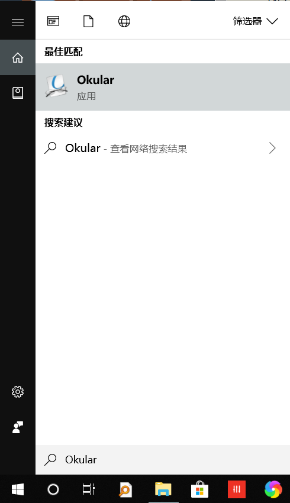

## How to Install Okular on Windows 10

### Quick Start

#### Install Chocolatey

The simplest way to install Okular on Windows is to use the software management tool  **Chocolatey**. You can follow the [guide](https://chocolatey.org/docs/installation) to complete the installation, or you can just follow the steps above:

  * Run `Get-ExecutionPolicy`. If it returns `Restricted`, then run `Set-ExecutionPolicy AllSigned` or `Set-ExecutionPolicy Bypass -Scope Process`. (**Note**: I got some trouble on this step when installing, but I simply ignore it and get into the second step, it works for me anyway.)
  * Now run the following command:
```bash
Set-ExecutionPolicy Bypass -Scope Process -Force; iex ((New-Object System.Net.WebClient).DownloadString('https://chocolatey.org/install.ps1'))
```

#### Install and upgrade Okular

To install Okular, run the following command from the command line or from PowerShell: 

```bash
choco install okular
```
To upgrade Okular, run the following command from the command line or from PowerShell:

```bash
choco upgrade okular
```

The software manager will install several packages automatically, and the terminal will ask you for your permission to install them. So when you see **"Do you want to run the script?([Y]es/[N]o/[P]rint):"**, Type a "Y" and Enter.

Here is the results:

```bash
okular v19.04.1 [Approved]
okular package files install completed. Performing other installation steps.
The package okular wants to run 'chocolateyInstall.ps1'.
Note: If you don't run this script, the installation will fail.
Note: To confirm automatically next time, use '-y' or consider:
choco feature enable -n allowGlobalConfirmation
Do you want to run the script?([Y]es/[N]o/[P]rint): y

Installing 64-bit okular...
okular has been installed.
  okular may be able to be automatically uninstalled.
 The install of okular was successful.
  Software installed as 'exe', install location is likely default.

Chocolatey installed 9/9 packages.
 See the log for details (C:\ProgramData\chocolatey\logs\chocolatey.log).
```

To give you an example, my installation ends up with the following messages:
```bash
Installed:
 - kb2919355 v1.0.20160915
 - kb3033929 v1.0.5
 - chocolatey-core.extension v1.3.3
 - kb2999226 v1.0.20181019
 - kb2919442 v1.0.20160915
 - vcredist140 v14.20.27508.1
 - okular v19.04.1
 - kb3035131 v1.0.3
 - chocolatey-windowsupdate.extension v1.0.4

Packages requiring reboot:
 - vcredist140 (exit code 3010)

The recent package changes indicate a reboot is necessary.
 Please reboot at your earliest convenience.
```

After Okular installed successfully, and you will find it in your start menu.



### References

* [Chocolatey installation](https://chocolatey.org/docs/installation)
* [Okular installation](https://chocolatey.org/packages/okular)